<div align="center">


<br /><br />

### The block-based document studio — offline-first, keyboard-driven, endlessly extensible.

[](https://www.typescriptlang.org/)
[](https://react.dev/)
[](https://lexical.dev/)
[](https://vitejs.dev/)
[](#-your-data-stays-yours)
[](LICENSE)

[Highlights](#-highlights) · [Screenshot Tour](#-a-closer-look) · [Quick Start](#-quick-start) · [Architecture](#-architecture) · [Shortcuts](#️-keyboard-shortcuts) · [Roadmap](#-roadmap)

</div>

---

Obelisk is a local-first, block-based rich-text editor that runs entirely in your browser. No accounts, no servers, no telemetry — your documents live in IndexedDB and, whenever you choose, as real files on your disk. Built on [Lexical](https://lexical.dev/) for surgical control over the editing experience, with a plugin architecture that makes every feature composable and every block type extensible.

<div align="center">
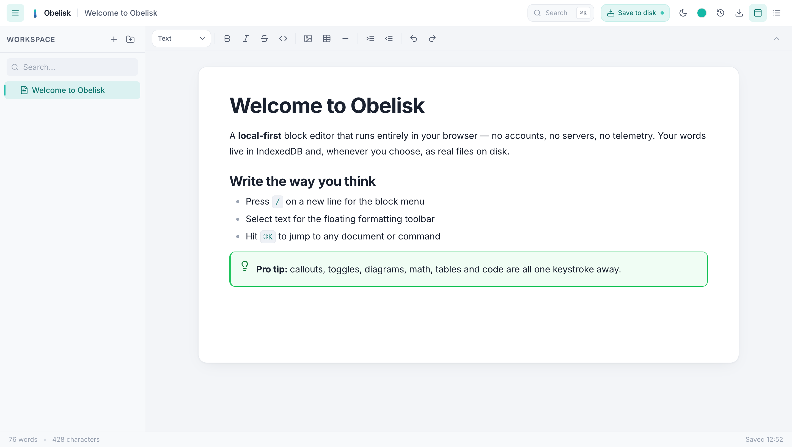
</div>

---

## ✨ Highlights

| | | |
| :-- | :-- | :-- |
| ⌨️ **Slash menu** — every block, one keystroke | 🎨 **Inline text & background color** | 💬 **Five callout styles** with themed icons |
| 📐 **KaTeX math** — inline & block, click to edit | 📊 **Mermaid diagrams** — live source + preview | 🔻 **Toggles, tables, code, quotes, dividers** |
| 🔗 **`@` mentions** that link to documents | 🗂 **Drag-to-reorder folder tree** | 🔍 **Fuzzy search & `⌘K` command palette** |
| 🌗 **Light / dark themes + 5 accent colors** | 💾 **Save to a real folder on disk** | 🕑 **Auto-save + version history** |

---

## 📸 A closer look

### ⌨️ Slash menu — every block, one keystroke

Press <kbd>/</kbd> on any empty line to summon the block menu. Fuzzy-search and insert text, headings, lists, code, tables, callouts, toggles, diagrams, math, images, embeds, and more — without ever leaving the keyboard.

<div align="center">
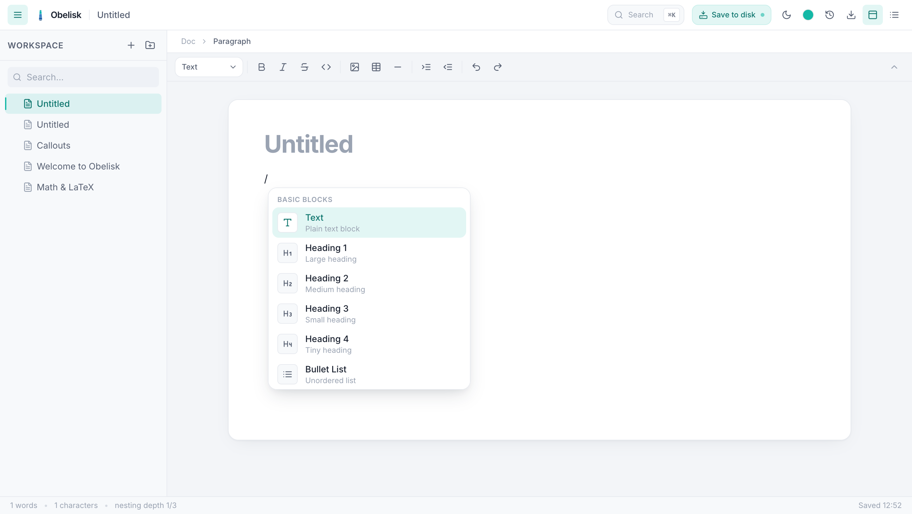
</div>

### 🎨 Floating toolbar & inline color

Select any text and a floating toolbar appears with **bold**, *italic*, strikethrough, code, highlight, super/subscript, links — plus an **inline-math** button and a **color picker** for both text and background.

<div align="center">
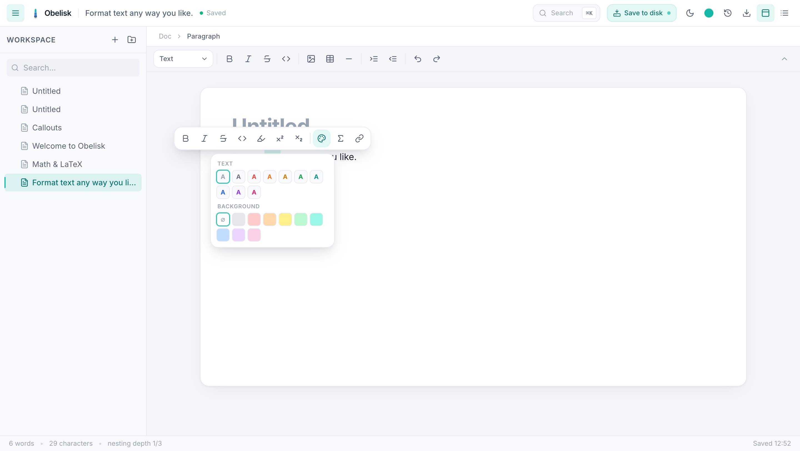
</div>

### 💬 Callouts for every kind of aside

Five semantic variants — **Info**, **Tip**, **Warning**, **Danger**, and **Note** — each with its own icon and themed colors that adapt to light and dark mode. Fully editable, multi-line, and nestable.

<div align="center">
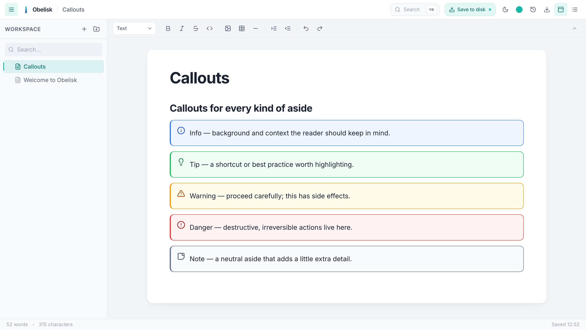
</div>

### 📊 Mermaid diagrams — inline source + live preview

Insert a Mermaid block and edit it **inline**: a split source/preview pane re-renders the diagram as you type. Click the diagram anytime to reopen the editor; click **Done** to collapse back to the rendered view.

<div align="center">
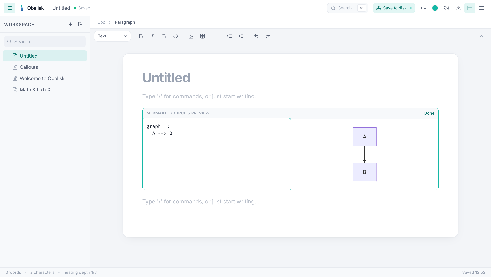
</div>

### 📐 Math & LaTeX — inline and block

Drop equations right into your prose or as centered display blocks, rendered with [KaTeX](https://katex.org/). **Click any formula — inline or block — to edit the LaTeX in place**, then click away to re-render.

<table>
<tr>
<td width="50%">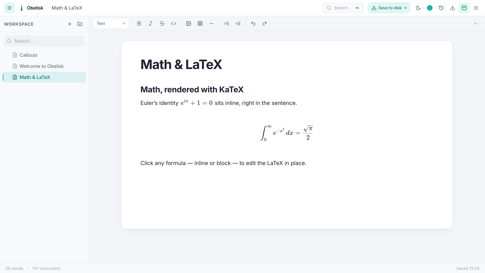</td>
<td width="50%">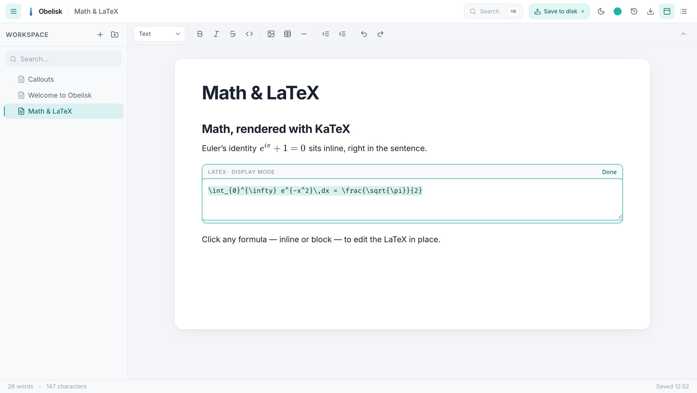</td>
</tr>
<tr>
<td align="center"><sub>Rendered inline + display math</sub></td>
<td align="center"><sub>Click to edit the LaTeX in place</sub></td>
</tr>
</table>

### 🔍 Command palette

<kbd>⌘</kbd><kbd>K</kbd> opens a fuzzy command palette — jump to any document, create docs and folders, insert blocks, switch theme, open version history, or export.

<div align="center">
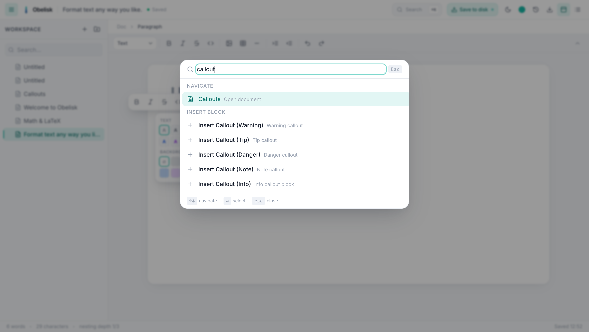
</div>

### 🔗 `@` mentions

Type <kbd>@</kbd> to link to another document. Mentions render as inline chips and are clickable — jump straight to the referenced doc.

<div align="center">
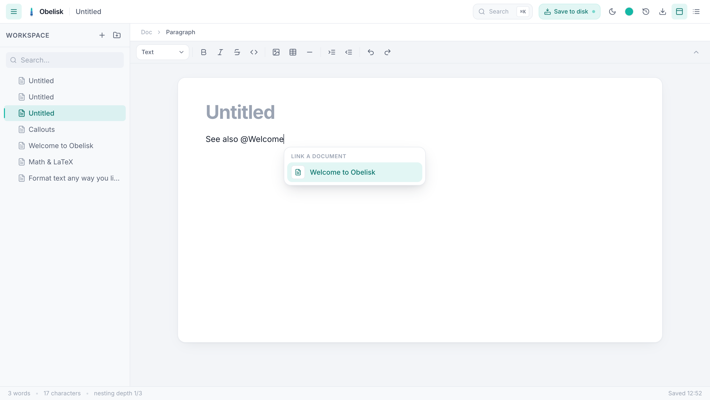
</div>

### 🌗 Themes — light, dark, and five accents

A semantic design-token system drives light and dark modes plus five accent colors (Teal, Blue, Violet, Rose, Amber). Your choice is remembered and applied before first paint — no flash.

<div align="center">
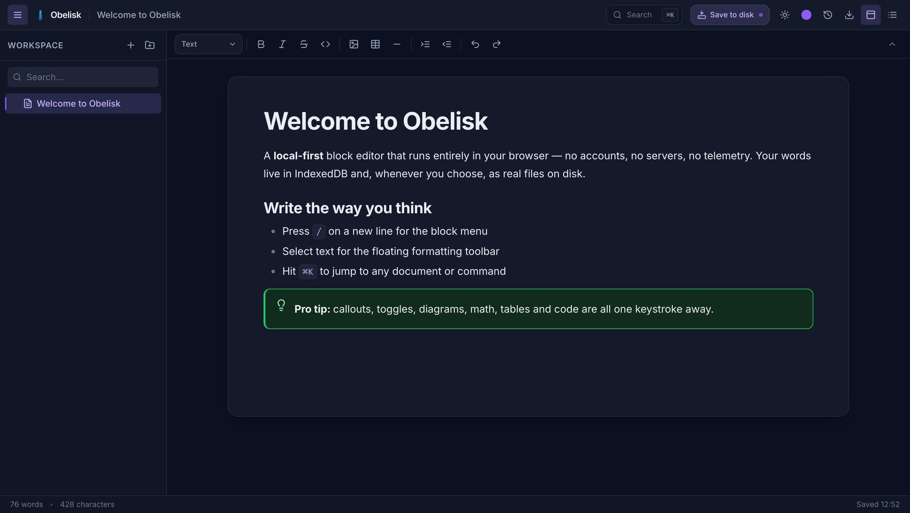
</div>

---

## 💾 Your data stays yours

Obelisk is **local-first**. Everything is stored in your browser's IndexedDB and persisted with the Storage API so it is never evicted — it survives reloads, restarts, and closing the tab.

When you want a real, portable copy, click **Save to disk**: pick a folder once and Obelisk mirrors your workspace there as a browsable tree of files. The button highlights whenever there are unsaved changes, and you decide when to write.

```text
my-workspace/
├── Project Notes/                 ← folders become real directories
│   └── Design Spec.json
├── Welcome to Obelisk.json        ← each doc is a lossless Lexical document
├── _assets/<docId>/diagram.png    ← images saved as real files
└── .obelisk-sync.json             ← manifest for clean, orphan-free re-syncs
```

Each `.json` is the **lossless** Lexical state, so a document opens back in Obelisk exactly as you left it — custom blocks and all. Need Markdown, HTML, or PDF? Open the doc and export on demand.

> **Note:** *Save to disk* uses the File System Access API, available in Chromium-based browsers (Chrome, Edge). Everywhere else, your work is still safely persisted in IndexedDB.

---

## 🧱 Feature reference

<details open>
<summary><b>Editor core</b></summary>

| Feature | Description |
| :--- | :--- |
| **Rich text** | Headings (H1–H6), bold, italic, strikethrough, highlight, superscript, subscript, inline code |
| **Text & background color** | Inline color picker in the floating toolbar |
| **Lists** | Bullet, numbered, and checklists, nested up to 3 levels |
| **Code blocks** | Syntax-highlighted fenced blocks |
| **Tables** | Full row/column editing via `@lexical/table` |
| **Links** | Inline links with URL editing in the floating toolbar |
| **Quotes & dividers** | Block quotes (`>`) and horizontal rules |

</details>

<details open>
<summary><b>Custom blocks</b></summary>

| Block | Description |
| :--- | :--- |
| **Callout** | Info / Warning / Tip / Danger / Note — variant icons + themed colors |
| **Toggle** | Collapsible, accordion-style sections |
| **Mermaid** | Live-rendered diagrams with an inline split source/preview editor |
| **Math (inline)** | KaTeX LaTeX within the text flow — click to edit |
| **Math (block)** | Display-mode LaTeX equations — click to edit |
| **Image** | Paste, drop, or pick — stored as blobs in IndexedDB |
| **Embed** | YouTube, Vimeo, Figma — auto-detected iframe rendering |
| **Mention** | `@`-reference that links to a document |
| **Divider** | Visual horizontal-rule separator |

</details>

<details>
<summary><b>Workspace, persistence & export</b></summary>

| Feature | Description |
| :--- | :--- |
| **Multi-document tree** | Create, rename, delete docs/folders; **drag to reorder & nest** |
| **Full-text search** | Fuzzy search across the whole workspace |
| **Command palette** | `⌘K` — navigate, insert, theme, export |
| **Outline panel** | Heading TOC with filter and click-to-scroll |
| **Auto-save** | Debounced save to IndexedDB with a status chip |
| **Version history** | Last 10 automatic snapshots — restore, rename, delete |
| **Save to disk** | One-click mirror of the workspace to a real folder (lossless JSON) |
| **Export** | JSON (lossless), Markdown (`.zip` + images), HTML (self-contained), PDF (print) |

</details>

---

## 🚀 Quick Start

**Prerequisites:** Node.js ≥ 18, npm ≥ 9.

```bash
git clone https://github.com/your-org/obelisk.git
cd obelisk
npm install
npm run dev
```

Open **http://localhost:5173** — that's it. No env vars, no API keys, no backend.

| Command | Description |
| :--- | :--- |
| `npm run dev` | Start the Vite dev server with HMR |
| `npm run build` | Type-check + production build to `dist/` |
| `npm run preview` | Serve the production build locally |
| `npx tsc --noEmit` | Type-check without emitting |

---

## 🏗 Architecture

```
┌─────────────────────────────────────────────────────────────────┐
│                         App Shell (React)                        │
├──────────┬──────────────────────────────────┬───────────────────┤
│ Sidebar  │         Editor (Lexical)         │  Outline Panel    │
│          │                                  │                   │
│ • Tree   │  ┌─ TopToolbar (collapsible) ─┐  │  • Heading TOC    │
│ • Search │  │ Breadcrumb                │  │  • Filter         │
│ • DnD    │  │ ┌────────────────────────┐│  │  • Click-to-nav   │
│          │  │ │   ContentEditable      ││  │                   │
│          │  │ │   (20+ Lexical nodes)  ││  │                   │
│          │  │ └────────────────────────┘│  │                   │
│          │  │ FloatingToolbar  SlashMenu│  │                   │
│          │  │ MentionMenu     Draggable │  │                   │
│          │  └───────────────────────────┘  │                   │
├──────────┴──────────────────────────────────┴───────────────────┤
│                     Footer (save status + time)                  │
└─────────────────────────────────────────────────────────────────┘
        │                  │                      │            │
   ┌────▼────┐     ┌──────▼──────┐       ┌───────▼─────┐ ┌───▼────────┐
   │ Zustand │     │   Lexical   │       │  IndexedDB  │ │ Disk folder│
   │  Store  │     │ EditorState │       │  (via idb)  │ │ (FS Access)│
   │ UI/Tree │     │ Nodes/Plugins│      │ docs/content│ │  *.json    │
   │ Theme   │     │ Commands     │      │ versions/…  │ │  _assets/  │
   └─────────┘     └─────────────┘       └─────────────┘ └────────────┘
```

### Project structure

```text
src/
├── App.tsx                     3-pane shell
├── components/                 Header, Footer, AccentPicker, SaveToDiskButton, ObeliskMark…
├── db/                         IndexedDB layer + File System Access handle store
│   ├── idb.ts                  Schema + openDB
│   ├── workspaceStore.impl.ts  Docs/folders/versions CRUD
│   ├── assetStore.impl.ts      Blob storage
│   └── fsHandle.ts             Persisted disk-folder handle
├── editor/
│   ├── Editor.tsx              LexicalComposer + plugin tree
│   ├── nodes/                  Custom node types (callout, toggle, mermaid, math…)
│   ├── plugins/                Slash, mention, floating toolbar, draggable block…
│   └── commands/               Block insert registry + palette data
├── features/
│   ├── workspace/              Sidebar, TreeItem (drag & drop), search
│   ├── commandPalette/         ⌘K dialog
│   ├── diskSync/               Save-to-disk folder mirroring
│   ├── outline/ breadcrumb/    Navigation
│   ├── versions/ export/       History + export modules
├── store/                      Zustand store + selectors
├── styles/                     editor.css, print.css
└── types/                      Models + ambient declarations
```

### Tech stack

| Layer | Choice | Why |
| :--- | :--- | :--- |
| **UI** | React 18 | Mature ecosystem, concurrent features |
| **Editor** | Lexical | Extensible, performant, Meta-backed |
| **State** | Zustand | Minimal, no boilerplate, outside-React access |
| **Storage** | IndexedDB (`idb`) + File System Access | Offline-first; optional real files on disk |
| **Styling** | TailwindCSS + CSS vars | Utility-first with token-driven theming |
| **Primitives** | Radix UI | Accessible, unstyled, composable |
| **Build** | Vite | Sub-second HMR, optimized chunks |
| **Math / Diagrams** | KaTeX / Mermaid | Lazy-loaded on demand |
| **Search** | Fuse.js | Client-side fuzzy search |

---

## ⌨️ Keyboard Shortcuts

| Shortcut | Action | | Shortcut | Action |
| :--- | :--- | :-- | :--- | :--- |
| `⌘ K` | Command palette | | `⌘ Z` | Undo |
| `⌘ B` | Bold | | `⌘ ⇧ Z` | Redo |
| `⌘ I` | Italic | | `Tab` / `⇧ Tab` | Indent / outdent |
| `⌘ ⇧ S` | Strikethrough | | `/` | Slash menu (line start) |
| `⌘ E` | Inline code | | `@` | Mention picker |

**Markdown shortcuts** (auto-convert): `# … ######` headings · `> ` quote · `- ` / `* ` bullet · `1. ` numbered · ` ``` ` code · `**bold**` · `_italic_` · `~~strike~~` · `` `code` ``.

---

## 🗺 Roadmap

- [x] Drag handle & block reordering
- [x] Inline color, math & Mermaid editing
- [x] Theme accents + save-to-disk
- [ ] **Open / restore from a disk folder** — rebuild a workspace from saved JSON
- [ ] **Linked databases** — Notion-style relational views
- [ ] **Real-time collaboration** — CRDT-based
- [ ] **PWA support** — installable, service-worker caching
- [ ] **Plugin API** — third-party block types
- [ ] **Mobile layout** — responsive editor with touch gestures

---

## 🤝 Contributing

1. **Fork** the repository
2. **Branch:** `git checkout -b feat/my-feature`
3. **Commit** with conventional commits: `feat:`, `fix:`, `docs:`, `refactor:`
4. **Push** and open a Pull Request

**Development notes**

- Run `npx tsc --noEmit` before committing — zero errors required
- Custom nodes must implement `exportJSON()` / `importJSON()` for lossless persistence
- Heavy deps (KaTeX, Mermaid) are lazy-loaded via dynamic `import()`
- CSS uses theme variables (`var(--*)`) — never hardcode colors

---

## 📄 License

MIT © Obelisk Contributors

---

<div align="center">


<sub>Built with Lexical, React, and an unhealthy obsession with block editors.</sub>

</div>
